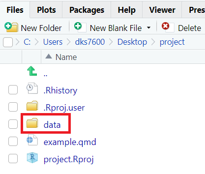
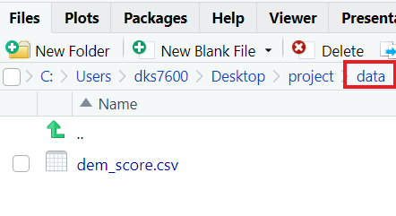

```{r setup, include=FALSE}
library(learnr)
library(tidyverse)
library(fivethirtyeight)
library(tutorialExtras)
library(gradethis)
library(tutorial.helpers)
library(ggcheck)

gradethis_setup()
knitr::opts_chunk$set(echo = FALSE)
options(
  tutorial.exercise.timelimit = 60
  #tutorial.storage = "local"
  ) 

dem_score <- read_csv("data/dem_score.csv")

drinks_smaller <- drinks %>% 
  filter(country %in% c("USA", "China", "Italy", "Saudi Arabia")) %>% 
  select(-total_litres_of_pure_alcohol) %>% 
  rename(beer = beer_servings, spirit = spirit_servings, wine = wine_servings)

drinks_smaller_tidy <- drinks_smaller |> 
  pivot_longer(-country,
               names_to = "type",
               values_to = "servings")

guat_dem <- dem_score %>% 
  filter(country == "Guatemala")

guat_dem_tidy <- guat_dem %>% 
  pivot_longer(
    cols = -country, 
    names_to = "year", 
    values_to = "democracy_score"
  ) |> 
  mutate(year = as.numeric(year))

```

```{r, context = "server"}
grade_server("grade")
```

```{r copy-code-chunk, child = system.file("child_documents/copy_button.Rmd", package = "tutorial.helpers")}
```

```{r Name}
question_text("Name:",
              answer_fn(function(value){
                              if(length(value) >= 1 ) {
                                return(mark_as(TRUE))
                                }
                              return(mark_as(FALSE) )
                              }),
              correct = "submitted",
              allow_retry = FALSE )
```

## Instructions

Complete this tutorial while reading Chapter 4 of the [textbook](https://nustat.github.io/intro-stat-data-sci/04-tidy.html).

You can check your current grade and the number of attempts you are on in the "View grade" section. You can click this button as often and as many times as you would like as you progress through the tutorial. Before submitting, make sure your grade is as expected.

### Goals

-   Understand what "tidy" data looks like.
-   Learn how to format data into "tidy" data.
-   Understand the main purposes of different packages.

## Importing data

Up to this point, we’ve almost entirely used data stored inside of an R package. Say instead you have your own data saved on your computer or somewhere online.

### 

Two common file types for data are `.csv` and `.xlsx` extensions.

### Exercise 1

To read in a `.csv` file we need the `readr` package.

### 

Use the `library()` function to load the **readr** package.

```{r importing-data-1, exercise = TRUE}

```

```{r importing-data-1-hint-1, eval = FALSE}
library(...)
```

```{r importing-data-1-solution, exercise.reveal_solution = FALSE}
library(readr)
```

```{r importing-data-1-check}
grade_this_code()
```

### Exercise 2

The `.csv` file `dem_score.csv` is accessible on the web at "<https://moderndive.com/data/dem_score.csv>".

Type `read_csv("https://moderndive.com/data/dem_score.csv")` to read in the file.

```{r importing-data-2, exercise = TRUE}

```

```{r importing-data-2-hint-1, eval = FALSE}
read_csv(...)
```

```{r importing-data-2-solution, exercise.reveal_solution = FALSE}
read_csv("https://moderndive.com/data/dem_score.csv")
```

```{r importing-data-2-check}
grade_this_code()
```

### 

In order to use this data frame later, we need to **store** it in our **Environment**.

### Exercise 3

Before reading in the file type `dem_score <-` to name the dataset `dem_score`.

```{r importing-data-3, exercise = TRUE}

```

<button onclick="transfer_code(this)">Copy previous code</button>

```{r importing-data-3-hint-1, eval = FALSE}
... <- read_csv("https://moderndive.com/data/dem_score.csv")
```

```{r importing-data-3-solution, exercise.reveal_solution = FALSE}
dem_score <- read_csv("https://moderndive.com/data/dem_score.csv")
```

```{r importing-data-3-check}
grade_this_code()
```

### 

Do NOT store the object as "dem_score.csv". Choose a name that is informative, yet easy to reference. Often times this can be the name of the file (without the extension type).

###

There is no output because we stored the data as an object.

### 

To get a better understanding of the data you could print the data by typing `dem_score` or use the `glimpse()` function.

### Exercise 4

The previous exercise showed how to read in a file from the web. However, most of the time you will be reading in data from you computer.

### 

Your project is known as your current working directory. Let's say you saved `dem_score.csv` in a `data/` sub directory within your project shown in the image below.

<center>

|  |  |  |
|--------------------------|:-----------------:|--------------------------|
| {width="200"} | ➔ | {width="200"} |

</center>

###

Within `read_csv()` we need to specify the file path of our data from our working directory. In this case `"data/dem_score.csv"`. 

Read in the file from the computer by typing `read_csv("data/dem_score.csv")`.

Store the file as `dem_score` using `dem_score <-` **before** read_csv. Then on the next line print the data by typing `dem_score`.

```{r importing-data-4, exercise = TRUE}

```

<button onclick="transfer_code(this)">Copy previous code</button>

```{r importing-data-4-hint-1, eval = FALSE}
... <- read_csv(...)
dem_score
```

```{r importing-data-4-solution, exercise.reveal_solution = FALSE}
dem_score <- read_csv("data/dem_score.csv")
dem_score
```

```{r importing-data-4-check}
grade_this_code()
```

###

Note that the `read_csv()` function included in the `readr` package is **different** than the `read.csv()` function that comes installed with R by default.

`read_csv()` is the preferred function and what that we will always use.

## Tidy data

In order to use the `ggplot2` and `dplyr` packages for data visualization and data wrangling, your input data frames must be in “tidy” format. So all non-“tidy” data must be converted to “tidy” format first.

### Exercise 1

Consider the following data frames that were created from the `drinks` data frame included in the `fivethirtyeight` package.

```{r, echo = TRUE}
drinks_smaller
```

```{r, echo = TRUE}
drinks_smaller_tidy
```

###

```{r tidy-data-1}
question_wordbank("Match the name of the data frame with the format it is in.",
           choices = c("drinks_smaller", "drinks_smaller_tidy"),
           wordbank = c("wide format", "long format"),
           answer(c("wide format","long format"),correct=TRUE),
           allow_retry = TRUE)
```

### Exercise 2

A dataset is messy or tidy depending on how rows, columns and tables are matched up with observations, variables and types.

```{r tidy-data-2}
question_wordbank("Complete the following three statements that define tidy data.",
           choices = c("Each variable forms a _____.",
                       "Each observation forms a _____.",
                       "Each type of observational unit forms a _____."),
           wordbank = c("column", "row", "table"),
           answer(c("column", "row", "table"),correct=TRUE),
           allow_retry = TRUE)
```

### Exercise 3

Determine if the following tables are in tidy format.

```{r tidy-data-1}
  question_wordbank("",
           choices = c(paste0(htmltools::img(src="images/Figure_04_1_tidy.png", height = 175, width = 350) ), paste0(htmltools::img(src="images/Figure_04_2_nontidy.png", height = 75, width = 350) ), paste0(htmltools::img(src="images/Figure_04_3_tidy.png", height = 75, width = 350) ) ),
           wordbank = c("Tidy", "Not tidy"),
           answer(c("Tidy", "Not tidy", "Tidy"), correct=TRUE),
           allow_retry = TRUE)
```

## Case study: Democracy in Guatemala

The below code filters the `dem_score` data frame we imported in "Importing data" to only include the country Guatemala.

```{r, echo = TRUE}
guat_dem <- dem_score %>% 
  filter(country == "Guatemala")

guat_dem
```

### Exercise 1

Let’s produce a time-series plot showing how the democracy scores have changed over the 40 years from 1952 to 1992 for Guatemala.

###

In order to do that we need to tidy the data so that we have a `year` variable that we can put on the `x`-axis.

###

Start with `guat_dem` and pipe on `pivot_longer(cols = -country)`

```{r case-study-1, exercise = TRUE}

```


```{r case-study-1-hint-1, eval = FALSE}
guat_dem %>%
  pivot_longer(...)
```

```{r case-study-1-solution, exercise.reveal_solution = FALSE}
guat_dem %>% 
  pivot_longer(
    cols = -country
  ) 
```

```{r case-study-1-check}
grade_this_code()
```

###

This tidies all variables that are **NOT** country because we used the minus (-) symbol.

###

Notice the names of the new variables are `name` and `value. Those are not very informative or accurate variable names. 

### Exercise 2

Within `pivot_longer()` we can specify the new variable names with the `names_to` and `values_to` arguments. 

###

Copy the previous code and set the names to `"year"` and the values to `"democracy_score"` as follows: `pivot_longer(cols = -country, names_to = "year", values_to = "democracy_score")` 

```{r case-study-2, exercise = TRUE}

```

<button onclick="transfer_code(this)">Copy previous code</button>

```{r case-study-2-hint-1, eval = FALSE}
guat_dem %>%
  pivot_longer(
    cols = -country, 
    names_to = ..., 
    values_to = ...
    )
```

```{r case-study-2-solution, exercise.reveal_solution = FALSE}
guat_dem %>% 
  pivot_longer(
    cols = -country, 
    names_to = "year", 
    values_to = "democracy_score"
  ) 
```

```{r case-study-2-check}
grade_this_code()
```


### Exercise 3

In order to reference or use this tidied data we need to store it. Copy the previous code and assign this new data to the name `guat_dem_tidy`.

Print the data after by typing `guat_dem_tidy` on the next line.

```{r case-study-3, exercise = TRUE}

```

<button onclick="transfer_code(this)">Copy previous code</button>

```{r case-study-3-hint-1, eval = FALSE}
... <- guat_dem %>%
  pivot_longer(
    cols = -country, 
    names_to = "year", 
    values_to = "democracy_score"
    )
guat_dem_tidy
```

```{r case-study-3-solution, exercise.reveal_solution = FALSE}
guat_dem_tidy <- guat_dem %>% 
  pivot_longer(
    cols = -country, 
    names_to = "year", 
    values_to = "democracy_score"
  ) 
guat_dem_tidy
```

```{r case-study-3-check}
grade_this_code()
```

###

Notice `year` is of type `chr` (character). 

### Exercise 4

If we were to plot `democracy_score` by `year` we would need `year` to be a numeric variable. To change the variable **type** we can use the `mutate()` function (Note: there is also a more advanced way to do this directly within `pivot_longer`). 

###

Start with `guat_dem_tidy` and pipe on `mutate(year = as.numeric(year))`

```{r case-study-4, exercise = TRUE}

```

```{r case-study-4-hint-1, eval = FALSE}
guat_dem_tidy |> 
  mutate(...)
```

```{r case-study-4-solution, exercise.reveal_solution = FALSE}
guat_dem_tidy %>% 
  mutate(year = as.numeric(year))
```

```{r case-study-4-check}
grade_this_code()
```

###

Within `mutate` we **overwrote** the variable `year` with a numeric version. In this case it is okay to overwrite the variable because we are not losing any information.

### Exercise 5

Copy the previous code and assign the new data frame to `guat_dem_tidy`. In other words overwrite the data frame.

```{r case-study-5, exercise = TRUE}

```

```{r case-study-5-hint-1, eval = FALSE}
... <- guat_dem_tidy |> 
  mutate(...)
```

```{r case-study-5-solution, exercise.reveal_solution = FALSE}
guat_dem_tidy <- guat_dem_tidy %>% 
  mutate(year = as.numeric(year))
```

```{r case-study-5-check}
grade_this_code()
```

###

Again it is okay to **overwrite** our data frame because we are not losing any of the original information.

### Exercise 6

Now we can create the plot to show how the democracy score of Guatemala changed from 1952 to 1992 using a `geom_line()`.

###

Within `ggplot()` set the first argument equal to `guat_dem_tidy` and the second argument equal to `aes(x = year, y = democracy_score)`. Add on the appropriate geom layer with the `+` operator.

```{r case-study-6, exercise = TRUE}

```

```{r case-study-6-hint-1, eval = FALSE}
ggplot(..., aes(x = ..., y = ...)) +
  geom_...()
```

```{r case-study-6-solution, exercise.reveal_solution = FALSE}
ggplot(guat_dem_tidy, aes(x = year, y = democracy_score)) +
  geom_line()
```

```{r case-study-6-check}
grade_this_code()
```


<!-- ## Reading Quiz -->

<!-- ```{r Q} -->
<!-- quiz( -->
<!--   caption = NULL, -->
<!--   #Question 2 -->
<!--   question("Q2) Which function allows you to import a .csv file into R?", -->
<!--            answer("read_spreadsheet()"), -->
<!--            answer("import_csv()"), -->
<!--            answer("read_csv()",correct=TRUE), -->
<!--            answer("readr()"), -->
<!--            answer("import_spreadsheet()"), -->
<!--            allow_retry = TRUE, -->
<!--     random_answer_order = TRUE), -->
<!--   #Question 4 -->
<!--   #Q7 -->
<!--   question_wordbank("Q7) Match the general description to the appropriate piece of code in the following code chunk:\n -->
<!--            drinks_smaller_tidy <- drinks_smaller %>% -->
<!--            pivot_longer(cols = -country, names_to = 'type', values_to = 'servings')", -->
<!--            choices = c("name of the variable in the new tidy data frame that contains the column names of the original un-tidy data frame", "name of un-tidy data frame", "function to tidy the data", "name of the column you don't want to tidy", "name of tidy data frame"), -->
<!--            wordbank = c("drinks_smaller", "type", "country", "drinks_smaller_tidy", "pivot_longer"), -->
<!--            answer(c("type", "drinks_smaller", "pivot_longer",  "country", "drinks_smaller_tidy"), correct = TRUE), -->
<!--            allow_retry = TRUE), -->
<!--   #Q8 -->
<!--   question_numeric("Q8) In what year did Guatemala have the lowest democracy score?",  -->
<!--            answer(82, correct = TRUE), -->
<!--            answer(1982, correct = TRUE), -->
<!--            allow_retry = TRUE), -->
<!--   #Q9 -->
<!--   question("Q9) What is the name of the 'umbrella' package that includes ggplot2, dplyr, readr, etc.?",  -->
<!--            type = "learnr_text", -->
<!--            answer("tidyverse", correct = TRUE), -->
<!--            allow_retry = TRUE), -->
<!--   #Q10 -->
<!--   question_wordbank("Q10) Match the following packages with their primary purpose.", -->
<!--            choices = c("data wrangling", "converting data to tidy format", "import data files such as .csv", "includes datasets for analysis", "data visualization"), -->
<!--            wordbank = c("nycflights13", "tidyr", "readr", "ggplot2", "dplyr"), -->
<!--            answer(c("dplyr", "tidyr", "readr", "nycflights13", "ggplot2"),correct=TRUE), -->
<!--            allow_retry = TRUE) -->
<!-- ) -->

<!-- ``` -->

## View grade

```{r}
grade_button_ui(id = "grade")
```


## Submit

Once you are finished:

-   Click the 'Download Grade' button below. This will download an html document of your grade summary.
-   Make sure your grade is correct and as expected!
-   Submit the downloaded html to Canvas.

```{r}
grade_print_ui("grade")
```
