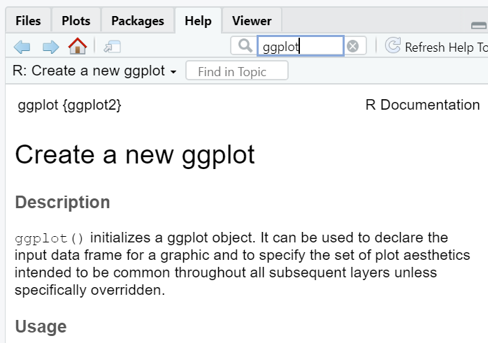

```{r setup, include=FALSE}
library(learnr)
library(tidyverse)
library(nycflights13)


#library(googlesheets4)
p1 <- try(find.package("gradethis"), silent = TRUE)
if(class(p1) == "try-error"){
  remotes::install_github("rstudio/gradethis")
}
p2 <- try(find.package("submitr"), silent = TRUE)
if(class(p2) == "try-error"){
  devtools::install_github("dtkaplan/submitr")
}
p3 <- try(find.package("googlesheets4"), silent = TRUE)
if(class(p3) == "try-error"){
  remotes::install_github("tidyverse/googlesheets4")
}
library(gradethis)
library(submitr)
library(googlesheets4)

gradethis_setup()
knitr::opts_chunk$set(echo = FALSE)

learnr::tutorial_options(
  #exercise.timelimit = 60, 
  exercise.checker = gradethis::grade_learnr)
  #submitr::null_code_checker)

cred <- "data/credentials.csv"

```


<!--Begin submitr setup-->

```{r}
submitr::login_controls()
```


```{r context = "server", echo = FALSE}

#options(tutorial.storage = "none")

vfun <- make_basic_validator(cred, "302") #password for instructor account 
#basket::check_valid
storage_actions <- record_local("my_submissions.csv")
  #record_gs4( key = "1ZFdsoowa8h4twu8tDzUyfgCehFt4uzzk4G-IWBLK3Z8",
  #  email = "statisticstutorials101@gmail.com",
  #  vfun  )


submitr::shiny_logic(input, output, session, vfun,
                     storage_actions)
```

<!--End of submitr setup-->


## Set up

R packages are a collection of R functions, compiled code, and sample data. When in RStudio, you can install packages by clicking on `Packages` followed by `Install` as shown in the picture below.

{width="226"}

Once a package is installed in order to use the functions in your code you must load the library in a code chunk. Load the tidyverse package by typing `library(tidyverse)`. This is equivalent to using the `import` function in Python.

```{r lib, exercise=TRUE}

```

The package `tidyverse` is one of the major packages used in R. You will almost always need to have it loaded. `tidyverse` is actually a package consisting of 8 packages that share a common design on how data should be structured.

{width="469"}

## Data

Often times you will need to read in a dataset. Common functions for this are `read_csv()` for a .csv, `read_delim()` for a .txt, and `load()` for a .rda file.

R also has many pre-loaded data sets that you can access. We are going to use the `flights` dataset from the `nycflights13` package shown below.

```{r data, exercise = TRUE}
library(nycflights13)
flights
```

## Help documentation

As a data scientist, you need to be an independent learner. That means you need to be able to learn and apply new functions without someone holding your hand. In this course, there will be a lot of times you will need to discover how to use a new function or determine what function you should be using.

There are a LOT of resources out there for you:

-   help documentation in R
-   Google search/stack exchange/stack overflow will be your best friend
-   ggplot2 textbook provides examples

We are going to use the `ggplot()` function to make plots. Let's look at the help documentation to see what arguments we can specify as well as some examples.

You can either go to help and search the function name:

{width="392"}

or type `?functionname` in the console. Run the code chunk below:

```{r help, exercise = TRUE}
?ggplot
```


## Plotting

The grammar of graphics states that in order to make a plot we need 3 components: data, aesthetics, and geometries. There are additional components: facets, scales, coordinates, and themes that we will learn throughout the course to improve our display.

Time to make our first plot.

Use the `flights` dataset to make a scatterplot of `arr_delay` by `dep_delay`. Fill in `dep_delay` for the x aesthetic and `arr_delay` for the y aesthetic. Add the layer `geom_point()` to make a scatterplot.

```{r scatter, exercise=TRUE}
ggplot(data = ___, mapping = aes(x = ___, y = ___)) +
  ____
```

```{r scatter-solution, exercise.reveal_solution = FALSE}
ggplot(data = flights, mapping = aes(x = dep_delay, y = arr_delay)) +
  geom_point()
```

```{r scatter-code-check}
grade_this_code()
```

Notice we always initialize a plot with the function `ggplot()`. Plotting is made easy in R with layering! Anytime you want to add a component to the plot you use `+` to add a layer.

Let's try another plot. Make a bar plot of `origin` in the `flights` data set. Map `origin` to the x aesthetic and this time add on the layer `geom_bar()`. (If we had pre-counted data instead of a list we would use the layer `geom_col()`).

```{r bar, exercise=TRUE}

```

```{r bar-solution, exercise.reveal_solution = FALSE}
ggplot(data = flights, mapping = aes(x = origin)) +
  geom_bar()
```

```{r bar-code-check}
grade_this_code()
```

Other basic geometry layers include `geom_line()` for a linegraph, `geom_histogram()` for a histogram, and `geom_boxplot()` for a boxplot.

## Data wrangling

Often times before making a plot you may need to do some data wrangling to get the data of interest. We will introduce a few common functions.

`<-` is an assignment operator

`%>%` is a pipe operator

Similar to the `+` operator in ggplot(), the `%>%` operator makes it easy to chain together multiple criteria.

```{r ohare, exercise = TRUE}
flights_ohare <- flights %>%
  filter(dest == "ORD")
```

What the above code says is pipe the data `flights` into the filter function, select only the rows in which the variable `dest` equals "ORD", and store this output as `flights_ohare`. In RStudio, the new dataset will appear in the environment pane.

**filter()**: subsets a dataset based on observation (rows) based on a conditional statement

Subset the `flights` dataset to only contain observations in which `dep_delay` is greater than 0. Call the new dataset `flights_delayed`.

```{r filter, exercise=TRUE}

```

```{r filter-solution, exercise.reveal_solution = FALSE}
flights_delayed <- flights %>%
  filter(dep_delay > 0)
```

```{r filter-code-check}
grade_this_code()
```

**select()**: subsets a dataset to only include specified variables (columns)

**mutate()**: creates a new variable based on the formula defined.

Let's figure out if flight time was longer or shorter than expected. Select only the variables `dep_delay` and `arr_delay`. Create a new variable called `flight_delay`, where `flight_delay = arr_delay - dep_delay`. Notice we are not storing the output here so the result will be printed.

```{r mutate, exercise=TRUE}
flights %>%
  select() %>%
  mutate()
```

```{r mutate-solution, exercise.reveal_solution = FALSE}
flights %>%
  select(dep_delay, arr_delay) %>%
  mutate(flight_delay = arr_delay - dep_delay)
```

```{r mutate-code-check}
grade_this_code()
```

**group_by()**: takes an existing data frame and converts it into a grouped data frame

**summarize()**: reduces the dataframe to a summary of specified values

Let's figure out if a particular `origin` is more likely to have a delayed flight (`dep_delay`) by computing the `mean()` and `sd()` by `origin`. We will need to remove the NA values by setting`na.rm = TRUE` inside the `mean()` and `sd()` functions.

```{r summarize, exercise=TRUE}
flights %>%
  group_by() %>%
  summarize(mean = mean(),
            sd = sd())
```

```{r summarize-solution, exercise.reveal_solution = FALSE}
flights %>%
  group_by(origin) %>%
  summarize(mean = mean(dep_delay, na.rm = TRUE),
            sd = sd(dep_delay, na.rm = TRUE))
```

```{r summarize-code-check}
grade_this_code()
```

## Factor variables

Factor (or categorical) variables can be tricky to work with in that they are inherently ordered (generally by default alphabetically)

```{r levels, exercise=TRUE}
levels( factor(flights$origin) )
```

Here our levels are "EWR", "JFK", "LGA", notice in our barplot in the Plotting section the bars appeared in this order. If we want to change the order of our bars we need to change the order of our levels.

```{r levels-order, exercise=TRUE}
flights <- flights %>%
  mutate(
    origin = factor(origin,
                    levels = c( "JFK", "LGA", "EWR")
    )
  )
```

By assigning the new variable as the existing variable `origin` we are **overwriting** the previous variable. Same with assigning the new dataset to be `flights`. Be very careful when overwriting data and variables! You only want to do this if you are not altering the dataset - you do not want to lose information!

Now make the bar plot of `origin` in the `flights` data set again and observe how the bar order has changed.

```{r bar2, exercise=TRUE}

```

```{r bar2-solution, exercise.reveal_solution = FALSE}
ggplot(data = flights, mapping = aes(x = origin)) +
  geom_bar()
```

```{r bar2-code-check}
grade_this_code()
```

### Advanced factor ordering

**Advanced ordering** what if we had a lot of variables and wanted to order the factors from low to high? or high to low?

Let's reorder the variable `dest` from low to high counts. First we need to get the counts for each `dest`. Then we will sort the data using `arrange` based on the number of counts. Next we will reorder the variable using the `fct_inorder()` function, set `ordered = TRUE`. This will set the factor order to be based on order of appearance.

```{r bar3, exercise = TRUE}
dest_ordered <- flights %>%
  #get counts for dest
  count(___) %>%
  #sort data from low to high counts
  #look at data output to see name of new variable to put here
  arrange(___) %>%
  #Reorder factor levels based on order of appearance
  mutate(dest = ___(dest, ordered = ___))

```

```{r bar3-solution, exercise.reveal_solution = FALSE}
dest_ordered <- flights %>%
  #get counts for dest
  count(dest) %>%
  #sort data from low to high counts
  #look at data output to see name of new variable to put here
  arrange(n) %>%
  #Reorder factor levels based on order of appearance
  mutate(dest = fct_inorder(dest, ordered = TRUE))
```

```{r bar3-code-check}
grade_this_code()
```

Make a bar plot of `dest_ordered`. This is now pre-counted data so use the layer `geom_col()`.

```{r bar4, exercise=TRUE}

```

```{r bar4-solution, exercise.reveal_solution = FALSE}
ggplot(data = dest_ordered, mapping = aes(x = dest)) +
  geom_col()
```

```{r bar4-code-check}
grade_this_code()
```

